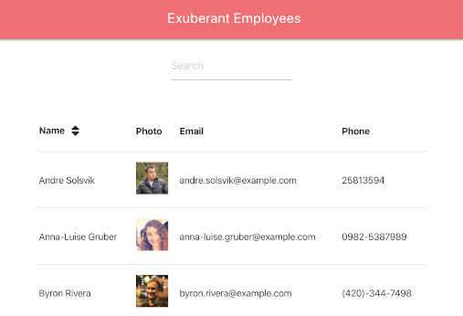

# Employee Directory

## Description

An application that shows the employees of a company along with necessary data. Employees can be sorted by name alphabetically or reverse alphabetically. Any part of an employee name can also be searched in the search bar, with the table results filtering below.

## [Try it yourself!](https://powerful-oasis-78948.herokuapp.com/)

The following image shows a glimpse of the application:

## Getting Started

This is a simple application that runs right in the browser, no installation or downloads needed.

## Built With:

React - JavaScript library 
Axios - NPM package 
Materialize - CSS framework 
Randomuser.me - API

## Author:

Brittany Fortner  
See commit history [here](https://github.com/bfeliz/employee-directory/graphs/contributors).

## Planned Updates

There are no plans to further update this application at this time.
